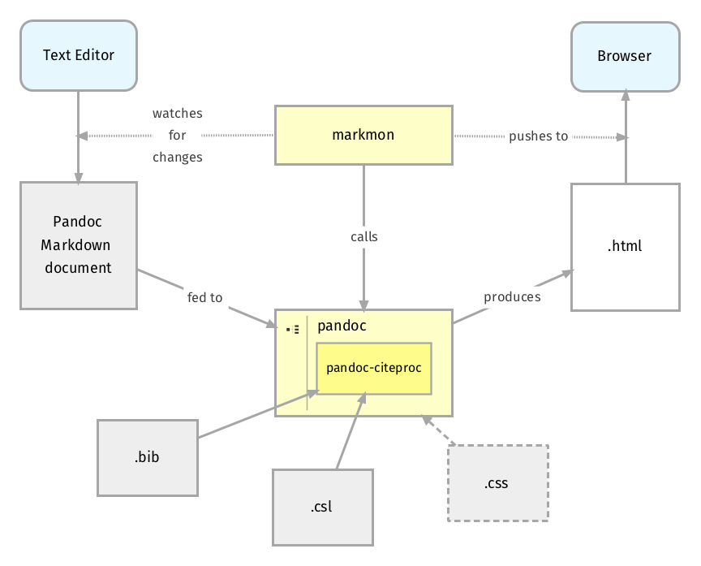

# Pandoc

1. Conversor de formatos
2. Soportado por muchos editores, aunque es texto plano en el fondo
3. Abstrae del aprender latex
4. Permite insertar código latex o HTML cuando sea necesario

## Subitítulo



## Ejemplo Código Fuente

```c
#include <stdio.h>

int main (int argc,char **argv)
{
   printf("Hola mundo\n");
   return 0;
}
```